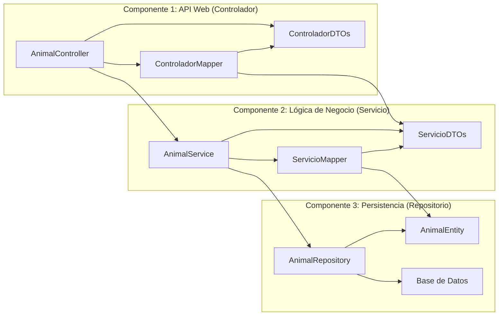

# Inversión de control

Lo que hacemos es usa un framework que es el que asume el control del flujo de la aplicación.
NO DESARROLLAMOS EL FLUJO. EL FLUJO LO PONE EL FRAMEWORK DE INVERSIÓN DE CONTROL.

Esto se consigue en gran medida por usar un lenguaje DECLARATIVO, en lugar de un lenguaje IMPERATIVO.

Spring nos ofrece un lenguaje DECLARATIVO para CONFIGURAR nuestras aplicaciones.

## Lenguaje declarativo vs imperativo

En el mundo del software tenemos paradigmas de programación, que solo es una forma un tanto hortera de referirnos a FORMAS de usar un lenguaje para expresar nuestras ideas.

En Español también hacemos eso:

> Felipe, pon una silla debajo de la ventana. ORACIÓN IMPERATIVA

Estamos muy acostumbrados a usar lenguaje imperativo, pero es un asco! Y cada día nos gusta menos y lo usamos menos.
De hecho la mayoría de frameworks/herramientas modernos usan lenguaje declarativo: Spring, Angular, Ansible, Docker, Kubernetes, Terraform, etc.

> Felipe, SI (ID) hay algo que no sea una silla debajo de la ventana:
    >   QUITALO !!!
> Felipe, SI (IF) no hay una silla debajo de la ventana:
    > Felipe, Si no hay sillas:
        > Vete al Ikea a por una silla
    > Felipe, pon una silla debajo de la ventana.

Qué ocurre si ya hay una silla? Qué me dice Felipe? 
- Exit code 127
- HTTP Status 404
- Error GORDO EXCEPTION: No puedo poner una silla debajo de la ventana

Al usar un lenguaje imperativo, nos centramos en lo que Felipe debe ir haciendo... y perdemos de vista nuestro OBJETIVO: Lo que queremos conseguir.

> Felipe, debajo de la ventana ha de haber una silla... Doy una orden? No, simplemente lo declaro.

Hablo de un ESTADO FINAL! No de un PROCESO. El proceso es TU PUÑETERO PROBLEMA FELIPE !

Cuando usamos un lenguaje DECLARATIVO delegamos la responsabilidad de cómo conseguir el estado final en un tercero: FRAMEWORK.

## Inversión de control.

DEFINIR EL PROGRAMA (Las cosas que debe hacer... sus componentes) SIN DAR INFORMACION DE FLUJO (O poca)

> Ejemplo: quiero montar una programa (PROCESO BATCH) que lea un fichero de texto, de cada linea extraiga lo datos(son datos de personas), los valide, y los inserte en una base de datos. 
> Ah.. y que si hay un error e la validación, que esa persona la añada a un listado...
> Ah... y la validación... que mire que el DNI tiene una estructura correcta.
> Ah... y que cuando acabes de meter a todas las personas en la BBDD, mande otro email
> Ah... Y que mande un email al empezar
> Y luego ese listado lo mande también por email.

            ^^^^ ESTO ES LO QUE HACEMOS CON SPRING. 
                    Así escribimos una app spring. El problema es que estamos acostumbrados a escribir apps de las que controlamos el flujo. Y al usar Spring, SPRING PONE EL FLUJO.
                    LO LLEVA HARCODEADO DENTRO DE SUS LIBRERIAS.

                    Y necesitamos conocer ese flujo para poder usar Spring y para entender una aplicación Spring

PSEUDO CÓDIGO / ALGORITMO

0. Mandar un email de comienzo
1. Mirar si el fichero existe:
    NO: ERROR y CORREO
    SI: Seguimos al paso 2
2. Abrir el fichero
3. Leer linea a linea (BUCLE):
   3.1. Validar DNI. 
    NO: Añadir a la lista de errores
    SI: Insertar en la BBDD
4. Cerrar el fichero
5. Mandar email de fin
6. Mandar email de errores

¿Qué acabamos de hacer aquí? DEFINIR EL FLUJO DE ESE PROCESO (PROGRAMA)

## Usando Spring:

Con Spring vamos a montar un programa en JAVA... y ese programa tendrá una clase con un método MAIN:

```java
public class ProcesoBatch {
    public static void main(String[] args) {
        // Al usar Spring, nuestro main va a tener 1 línea de código
        Spring.ejecuta(MiPrograma); // Aquí es donde Spring asume el control del flujo
                                    // Donde delego a Spring el control del flujo de mi aplicación
    }
}
```

Si fuerais Spring, lo primero que preguntaríais es:
¿Qué hace el programa? ¿Qué componentes tiene? ¿Qué hace cada componente?
Y nuestro trabajo es EXPLICARLE ESO A SPRING.
SPRING ES EL QUE LE DA FORMA A NUESTRA APLICACIÓN.

---

# Spring facilita el uso de un patrón de INYECCION DE DEPENDENCIAS

## SOLID

Esto es básico. Son 5 principios... recopilados por Robert C. Martin (Uncle Bob) en los 90s.
Esos principio s van orientados a mejorar, paliar, conseguir resolver el gran problema del desarrollo de software:
- Escribir un software es algo bastante fácil.
- El problema gordo es montar un software que sea fácil de mantener y evolucionar.

Cada letra es un principio:
- S: Single Responsability Principle
- O: Open/Closed Principle
- L: Liskov Substitution Principle
- I: Interface Segregation Principle
- D: Dependency Inversion Principle

Estas cosas son PRINCIPIOS. Los principios se respetan o no se respetan.

## Dependency Inversion Principle (Principio de inversión de la dependencia):

Un componente de un sistema de alto nivel no debería depender de una implementación de un componente de bajo nivel. Ambos deberían depender de abstracciones.

## Inyección de dependencias

Es un patrón de diseño que nos permite cumplir con el principio de inversión de la dependencia: se suministran objetos a una clase en lugar de ser la propia clase la que cree dichos objetos

Y al final, Spring es una herramienta (framework) creado para facilitar el uso de este patrón de diseño.
El motivo de existencia de Spring es proveer una forma sencilla de usar el patrón de inyección de dependencias, para ayudarnos a crear software que cumpla con el PRINCIPIO DE INVERSIÓN DE DEPENDENCIAS.

> Ejemplo: Quiero montar una aplicación de consola, a la que paso un idioma y una palabra... y me diga si la palabra existe en ese idioma... y en ese caso me de los significados de la palabra.

PRIMERO: Cuantos proyectos / subproyectos monto para este programa? REPOS DE GIT? Archivos JARs?
Claramente 3:
- Frontal: App de consola
- API del backend: El que facilita la comunicación entre ambos.
- Backend: El que maneja diccionarios

### Empezamos por al API: diccionarios-api.jar (Mi jar tiene 2 ficheros.)

```java
package com.curso.diccionarios.api;
public interface Diccionario {
    String getIdioma();
    boolean existe(String palabra);
    Optional<List<String>> getSignificados(String palabra);
        // Y si le paso la palabra "ARCHILOCOCO" en idioma español.. qué devuelve? NPI. Opciones:
        // - Una lista vacía   \  SON AMBIGUAS. Viendo la definición de la función, no sé que constestará.
        // - null              /
        //- Lanzar una excepción: Está guay... AL MENOS ES EXPLICITO EL COMPORTAMIENTO (throws PalabraNoEncontradaException)
        //  El problema es que lanzar una excepción es muy caro (computacionalmente hablando) NUNCA DEBERIA LANZAR UNA EXCEPCIÓN
        //  PARA CONTROLAR FLUJO DE PROGRAMA. Las excepciones son para cosas excepcionales. Para cosas que sé que pueden pasar pero que no hay forma de anticipar. 
        // Sabéis por qué el dilema de cuál elegir? POR QUE LAS 3 SON UNA MIERDA ENORME!
        // Y por ello en java 1.8 se crea la clase: Optional<T>
        // Al optional luego le puedo preguntar si dentro hay algo o no. Y si hay algo, lo saco. Y si no hay nada, pues no hago nada.
        // Esto quita la ambigüedad.
}

public interface SuministradorDeDiccionarios {
    boolean tienesDiccionarioDe(String idioma);
    Optional<Diccionario> getDiccionario(String idioma);
}
```
#### Siguiente paso: PRUEBAS DE LA API

> Prueba 1: Dame un diccionario de un idioma que exista: ESPAÑOL:

GIVEN (DADO):       Dado un suministrador de diccionarios que tiene un diccionario de español
                        SuministradorDeDiccionario miSuministrador = // LO QUE SEA... es un dado... presupongo que lo tengo;
WHEN (CUANDO):      Cuando pido un diccionario de español
                        Diccionario diccionario = miSuministrador.getDiccionario("es");
THEN (ENTONCES):    Entonces me devuelve un diccionario de español
                        assertNotNull(diccionario);
                        assetEquals("es", diccionario.getIdioma());

> Prueba 2: Dame un diccionario de un idioma que no exista: EL DE LOS ELFOS DEL BOSQUE

GIVEN (DADO):       Dado un suministrador de diccionarios que NO tiene un diccionario de los elfos del bosque
                        SuministradorDeDiccionario miSuministrador = // LO QUE SEA... es un dado... presupongo que lo tengo;
WHEN (CUANDO):      Cuando pido un diccionario de elfos del bosque
                        Diccionario diccionario = miSuministrador.getDiccionario("elfos del bosque");
THEN (ENTONCES):    Entonces me devuelve null <<< Y AQUÍ ES DONDE SONAR OS ESCUPE EL CÓDIGO A LA CARA !!!!!
                        assertNull(diccionario); = MIERDA
                        // Otra opción:
                        assertTrue(diccionario.isEmpty());

SonarQube es una herramienta de análisis de calidad de código. INDRA LA USA INTENSAMENTE en muchos proyectos.
Desde JAVA 1.8 está PROHIBIDO QUE UNA FUNCIÓN DEVUELVA null. Y si lo hace, SONAR OS ESCUPE A LA CARA.
Por qué? ES AMBIGUO!!!

### Equipo de frontal (consola)

```java
package com.curso.diccionarios.frontal;

import com.curso.diccionarios.api.Diccionario;
import com.curso.diccionarios.api.SuministradorDeDiccionarios;
//import com.curso.diccionarios.api.SuministradorDeDiccionariosDesdeFichero; 
                                                    // Y AQUI ES DONDE LA HE REGAO!
                                                    // ESTA LINEA HA MATADO EL PROYECTO,
                                                    // ME ACABO DE CAGAR EN EL PRINCIPIO DE INVERSION DE LA DEPENDENCIA

//Un componente de un sistema de alto nivel no debería depender de una implementación de un componente de bajo nivel. 
// Ambos deberían depender de abstracciones (nuestra interfaz)
/*
        App consola -> API <- Backend
            |                   ^
            +-------------------+
*/
// Qué implica? Si el día de mañana, los de la implementación del backend deciden cambiar el constructor.
// Los de la consola necesitan cambiar su código. VIVA LA MANTENIBILIDAD !!!!

// Para que respetase el ppo de inversión de la dependencia, debería haber hecho esto:
/*
        App consola -> API <- Backend

Dicho de otra forma, el el pom.xml de maven del proyecto consola, la única dependencia que debería tener es la de la API.
*/

public class Consola {
    public static void main(String[] args) {    
        // Lo que sea
    }

    public void procesaPeticion(String idioma, String palabra, SuministradorDeDiccionarios miSuministrador) { // INYECCION DE DEPENDENCIAS
        //SuministradorDeDiccionarios miSuministrador = new SuministradorDeDiccionariosDesdeFichero();
        if(miSuministrador.tienesDiccionarioDe(idioma)){
            Diccionario diccionario = miSuministrador.getDiccionario(idioma).get();
            if(diccionario.existe(palabra)){
                // Muestro los significados por pantalla
            } else {
                System.out.println("La palabra no existe");
            }
        } else {
            System.out.println("No tengo diccionario de ese idioma");
        }
    }
}
```

Claro... alguien podría decir ahora que lo único que he hecho es llevar el problema a otro sitio!
Quien sea que llame a la función procesaPeticion, necesita pasar una instancia de SuministradorDeDiccionarios.

CIERTO ES!!!
Pero... aquí es donde entra Un FRAMEWORK DE INVERSIÓN DE CONTROL: SPRING

como Spring es el que impone/controla el flujo de mi aplicación -> Spring será quien llame a la función procesaPeticion, no yo... desde una función que yo cree... Sino Spring.
Y Spring mira que necesita esa función... Y se da cuenta que necesita un SuministradorDeDiccionarios... 
y Spring buscará una implementación de SuministradorDeDiccionarios... la que encuentre... la que le hayan configurado... 
Creará una instancia de esa implementación... y la pasará a la función procesaPeticion.

### Equipo de backend (diccionarios en ficheros de texto) Otro JAR con 2 ficheros: diccionarios-fichero.jar

```java
package com.curso.diccionarios.impl;
public class DiccionarioDesdeFichero  implements Diccionario {
    public String getIdioma() {
        // Lo que sea que hace
    }
    public boolean existe(String palabra) {
        // Lo que sea que hace
    }
    public Optional<List<String>> getSignificados(String palabra){
        // Lo que sea que hace
    }
}

public class SuministradorDeDiccionariosDesdeFichero implements SuministradorDeDiccionarios {
    public boolean tienesDiccionarioDe(String idioma) {
        // Lo que sea que hace
    }
    public Optional<Diccionario> getDiccionario(String idioma) {
        // Lo que sea que hace
    }
}
```


---

# Qué es Spring?

Framework para el desarrollo de apps Java, que ofrece:
- Inversión de control
- Mecanismo simplificado de Inyección de dependencias.

Spring tiene 200 librerías dentro!

---

## Inyección de dependencias con Spring

### Cómo indicar a Spring qué debe entregar cuando alguien le pida una instancia de una clase/interfaz?

Antiguamente se configuraba en ficheros XML de qué clase Sprig tenía que generar una instancia cuando alguien le pidiera una instancia de una clase/interfaz. NI DE COÑA HACEMOS ESTO YA DESDE HACE 15 años...
2 opciones:

#### OPCIÓN 1: Usando la anotación @Component

```java
public interface MiInterfaz {
    void miMetodo();
}

package com.curso.impl;
@Component // Si alguien te pide una instancia de MiInterfazImpl o de MiInterfaz, dale una instancia de MiInterfazImpl
           // NOTA.. aunque nunca se me ocurriría pedir una instancia de MiInterfazImpl... siempre pediría una instancia de MiInterfaz
           // Por qué? PORQUE ME ESTARÍA CAGANDO EN EL PPO DE INVERSION DE LA DEPENDENCIA
public class MiInterfazImpl implements MiInterfaz {
    public void miMetodo(){
        // Lo que sea que hace
    }
}

public class MiClase {
    private final MiInterfaz dependenciaQueNecesito;

    public MiClase(MiInterfaz dependenciaQueNecesito){
        this.dependenciaQueNecesito = dependenciaQueNecesito;
    }
}

public class MiClase2 {
    private final MiInterfazImpl dependenciaQueNecesito;

    public MiClase2(MiInterfazImpl dependenciaQueNecesito){ // NUNCA... ROMPO EL PRINCIPIO DE INVERSION DE LA DEPENDENCIA   
        this.dependenciaQueNecesito = dependenciaQueNecesito;
    }
}

//En este caso, Spring pasará al constructor de MiClase una instancia de MiInterfazImpl, ya que implementa MiInterfaz.
```
Nota: 
- Esto funcionará si Spring tiene conciencia de la existencia de MiInterfazImpl. Si no, no funcionará.
  Cuando arranque Spring, le indicaré los paquetes de mi código (packages) donde buscar clases anotadas con @Component.
  Para cada clase que encuentre, podrá crear instancias y suministrarlas cuando alguien las pida.
- Nota2: Esto tiene una implicación... Me refiero al uso de la anotación @Component.
  Por usarla, Quién es quién va a crear instancias de esa clase anotada con @Component? SPRING. 
  Y eso implica que en su constructor no puedo pedirle a Spring que me inyecte dependencias.
- Más notas: Spring tiene un huevo de anotaciones variantes de @Component... que en su mayor parte solo proveen de SEMANTICA:
  - @Service        Es un component, que pa que me entienda otro que venga a leer este código, es un componente conceptualmente que ofrece un servicio.
  - @Repository     Es un component, que pa que me entienda otro que venga a leer este código, es un componente conceptualmente que ofrece un servicio de acceso a datos.
  - @Controller     Es un component, que pa que me entienda otro que venga a leer este código, es un componente conceptualmente que ofrece un a forma de exponer un servicio.
- Más: Spring también tiene algunas anotaciones que extienden de @Component pero que además implican otras funcionalidades:
  - @RestController 
- Y más: Por defecto, Spring creará una única instancia de cada clase anotada con @Component. Es decir la trabaja como si estuviera implementada con un patrón Singleton.

    ```java
    public class MiSingleton {  // Asi implementábamos un patrón Singleton de toda la vida: Una clase que me asegura que de ella solo se crea una única instancia.

        private static volatile MiSingleton instancia; // volatile: Para que java no cachee el valor de la variable a nivel de hilo, evitando problemas de concurrencia

        private MiSingleton(){
            // Mis cositas de inicialización
        }

        public static MiSingleton getInstancia(){
            if(instancia == null){                      // Para evitar el syncronized en cada llamada a getInstancia que es muy lento
                synchronized(MiSingleton.class){        // Para que 2 hilos paralelos no puedan entrar a ejecutar este código a la vez
                    if(instancia == null){              // Que solo se cree una instancia del objeto
                        instancia = new MiSingleton();
                    }
                }
            }
            return instancia;
        }
    }

    // Hoy en día con Spring:
    @Component
    public class MiSingleton {
        // Spring se encarga de que solo haya una instancia de esta clase
        // NOTA: Yo podría crear más... No es lo mismo que un Singleton de toda la vida... pero ... nos haces las veces... Y me ahorro mucha mierda de código.
    }
    ```
    Ese comportamiento se puede cambiar en Spring. Por ejemplo puedo hacer que cada vez que se pida una instancia, en lugar de entregar siempre la misma, que se cree una nueva.
    ```java
    @Component
    @Scope("prototype") // Cada vez que se pida una instancia de MiInterfaz, se creará una nueva
    public class MiClaseNormalita implements MiInterfaz{
    }
    ```
- Y más NOTAS: SI SPRING VE QUE HAY 2 clases que implementan una interfaz que se solicita... EXPLOTA ! NI ARRANCA
  A no ser... que le diga cuál de ellas usar... con la anotación @Primary para eso tengo otro huevo de anotaciones:
    - @Primary (Si hay otra da igual.. siempre usa esta)
    - @Qualifier("nombre")
      Cuando alguien pida, usará ese Qualifier. Ejemplo:

      ```java
        @Component
        @Qualifier("tipoA")
        public class MiClaseA implements MiInterfaz{
        }

        @Component
        @Qualifier("tipoB")
        public class MiClaseB implements MiInterfaz{
        }

        public class MiClase {
            private final MiInterfaz dependenciaQueNecesito;

            public MiClase(@Qualifier("tipoA") MiInterfaz dependenciaQueNecesito){
                this.dependenciaQueNecesito = dependenciaQueNecesito;
            }
        }
        ```

En cualquier caso, os he dicho que había 2 opciones para indicar a Spring qué debe entregar cuando alguien le pida una instancia de una clase/interfaz. 

SI ME VALE LA OPCIÓN 1, no sigo leyendo. ES LA MIA !!!!
Pero hay veces que no me sirve esa opción... por ejemplo?
> Imaginad que quiero que cuando alguien pida una instancia de UnaInterfaz, Spring le entregue una instancia de UnaClase, clase que no he creado YO... sino que es de una librería de terceros.

Puedo yo entrar en ese fichero UnaClase.java, para poner encima de public class... la anotación @Component? NO PUEDO. PROBLEMA.
En este caso: OPCION 2: 
CREAR UNA FUNCION ANOTADA CON @Bean dentro de una clase anotada con @Configuration

Ejemplo:

```java
// PERO ESTO NO ESTÁ EN MI CODIGO... está definido en una librería de terceros
    public interface UnaInterfaz {
        void unMetodo();
    }

    public class UnaClase implements UnaInterfaz {
        public void unMetodo(){
            // Lo que sea que hace
        }
    }

    public class OtraClase implements UnaInterfaz {
        public void unMetodo(){
            // Lo que sea que hace
        }
    }
// Y yo quiero decirle a Spring que una clase mía, necesito una implementación de UnaInterfaz... 
// Y que quiero que se le entregue una instancia de OtraClase... y no de UnaClase
// Me serviría con poner encima de OtraClase la anotación @Component... pero no puedo... porque no es mi código.

// Entonces... tengo que hacer esto:

@Configuration // Spring, echgale un ojito a esta clase.. que en ella defino métodos anotados con @Bean... 
// De hecho ejecuta esos métodos y lo que devuelvan, lo usa para inyectar dependencias
public class MiConfiguracion {

    @Bean // Spring, ejecuta esté método al arrancar
          // El resultado te lo guardas...
          // Y cuando alguien te pida una instancia de UnaInterfaz, le entregas lo que te devuelva este método
          //                                           ===========
    //     ===========
    public UnaInterfaz soyFederico(){ // Este método lo puedo llamar como quiera. No lo invocaré nunca.. Será Spring quien lo invoque
                                          // Y solo por llevar esa anotación @Bean
        return new OtraClase();
    }
}

public class MiClase {
    private final UnaInterfaz dependenciaQueNecesito;

    public MiClase(UnaInterfaz dependenciaQueNecesito){ // Aqui hago una solicitud de una dependencia.
                                                        // Spring me inyectará la instancia de UnaInterfaz que le haya devuelto el método soyFederico (Por ser el tipo de retorno de ese método el mismo que el argumento de este constructor)
        this.dependenciaQueNecesito = dependenciaQueNecesito;
    }
}
```
NOTA:
- El comportamiento de los métodos marcados con @Bean es el mismo que el de las clases marcadas con @Component.
  Por defecto, Spring solo llama una única vez a los métodos marcados con @Bean. Y guarda en su cache el resultado para futuras peticiones.
  Por supuesto eso se puede cambiar con la anotación @Scope("prototype") si quiero que cada vez que alguien pida una instancia de UnaInterfaz, se cree una nueva instancia de OtraClase.

### Cómo solicitar a Spring una dependencia (una instancia de un clase/interfaz) que necesite yo en mi programa?

#### OPCIÓN 1: Usando la anotación @Autowired

```java
import org.springframework.beans.factory.annotation.Autowired;

public class MiClase {
    @Autowired // SONARQUBE ME LO ESCUPE DE NUEVO... por mala práctica
    private MiInterfaz dependenciaQueNecesito;

    public MiClass(){
        // Aquí NO podría usar la variable dependenciaQueNecesito
    }

    public void miFuncion(){
        // Y aquí podría ya usar esa variable... que estaría cargadita!
    }
}
```

NOTAS:
1. Esto tiene un pequeño truco. Solo funciona si Spring es quién crea la instancia de MiClase. 
   Si la instancia la creo yo, no funcionará: Si yo hago:
    // MiClase miClase = new MiClase(); La variable va a estar VACIA ! Spring no la rellena. 
   Solo la rellena si Spring es quien crea la instancia de mi clase.
   Cómo le digo a Spring que cree una instancia de mi clase? YA LO VEREMOS !
2. ESTO NO SE USA HOY EN DIA!!!! MUY MALA PRACTICA ! por 2 motivos:
   - PROBLEMA DE SEGURIDAD + RENDIMIENTO: Spring al final es el que hará:
     ```java
        MiClase miClase = new MiClase();
        // Aquí es donde Spring hace la inyección...:
        // miClase.dependenciaQueNecesito = new MiInterfazImpl();
        // ESTA SEGUNDA LINEA FUNCIONA EN JAVA? LA VARIABLE ES PRIVADA
        // Spring en cualquier caso es capaz de establecer esa variable... cómo lo hace? REFLECTIONS
        // Eso lleva en JAVA desde 1.1. Me permite SALTARME TODAS LAS RESTRICCIONES DE VISIBILIDAD DE JAVA, accediendo directamente a memoria RAM y modificando allí variables.
        // Esto está considerado una VULNERABILIDAD DE SEGURIDAD. Y desde JAVA 9 (cuando se modulariza la JVM) se ha descativado por defecto el acceso a Reflections.
        // Además, es lento de narices (el rendimiento de ese tipo de operaciones es penoso)
     ```
    - LIMITACION DE LA FUNCIONALIDAD: Puedo usar esa variable en el constructor de MiClase()??? NI DE COÑA.. aún no esrá asignada. 

#### OPCIÓN 2: Simplemente escribiendo ese dato como un argumento de un método que sea involucrado por Spring

```java
public class MiClase {

    public void miFuncion(MiInterfaz dependenciaQueNecesito){
        // Y aquí podría ya usar esa variable... que estaría cargadita!
    }
}
```
NOTAS:
1. Lo que pasa es que esto solo funciona si? SI SPRING ES QUIEN LLAMA A LA FUNCION miFuncion. Si soy yo desde otro sitio de mi código quien llama a miFuncion, no funcionará. Si yo la llamo, tengo que pasar el dato.

#### OTRA OPCIÓN... No es nueva... es un híbrido de las 2 anteriores

```java
public class MiClase {

    private final MiInterfaz dependenciaQueNecesito;

    public MiClase(MiInterfaz dependenciaQueNecesito){ // Solicito la dependencia en el constructor de la clase
        this.dependenciaQueNecesito = dependenciaQueNecesito;
        // Ya puedo usar la variable en el constructor de la clase
    }

    public void miFuncion(){
        // Y aquí podría ya usar esa variable... que estaría cargadita!
    }
}
```

Si Spring es quién crea la instancia de la clase, es quien llama a su contructor... Que no es sino una función MAS! Y en esa función, le pido la dependencia que necesito (OPCION 2) . No hace falta @Autowired por ningún sitio en funciones.
- Esto no usa REFLECTIONS. Es más seguro y más rápido.
- Y además, puedo usar la variable en el constructor de la clase.
OPCION GUAY !!!!
---

# Getters y Setters de JAVA. Para qué sirven? ESTO ES UNA DE LAS GRANDES MIERDAS DE JAVA.

```java

// Esto lo hago el día 1
public class Persona {
    public int edad;
    public String nombre;
}

// En algún sitio, podría empezar a hacer desde el día 2... Cienes y cienes de personas usando mi clase en montón de sitios
Persona p = new Persona();
p.edad = 25;
p.nombre = "Felipe";
System.out.println(p.nombre);
System.out.println(p.edad);

// Día 100: Quiero limitar que la edad no pueda ser negativa
//necesito meter un 
if(edad < 0){
    throw new IllegalArgumentException("La edad no puede ser negativa");
}
// Pero java solo deja meter código en funciones. Me toca transforma eso que tenía en:
public class Persona {
    private int edad;
    public String nombre;

    public int getEdad(){
        return edad;
    }

    public void setEdad(int edad){
        if(edad < 0){ // RESTRICCIÓN DE NEGATIVOS
            throw new IllegalArgumentException("La edad no puede ser negativa");
        }
        this.edad = edad;
    }
}

// Sin problema... o SI HAY PROBLEMA??? // Claro que hay problema.. El problema es que el día 101 tengo a Cienes y cienes de personas
// persiguiéndome con un kalashnikov... porque les he roto su código.
// Para evitar esto me dicen: EL DIA 1... mete getters y setters de TODO... por si aca!
```
Eso funcionaría perfecto... pero... en JAVA me dices que eso es una MUY MUY MALA PRACTICA. Y es cierto.
Me dicen que necesito definir las variables privadas y crear los getters y setters, para encapsular el acceso a las variables.
Y ESA ES LA MENTIRA! Lo setter y los getter son la cutre-forma que tiene JAVA de lidiar con un problema de MANTENIMIENTO DEL CODIGO!


```java

public class Persona {
    private int edad;
    private String nombre;

    public Persona(int edad, String nombre){
        this.setEdad(edad);
        this.setNombre(nombre);
    }

    public int getEdad(){
        return edad;
    }

    public void setEdad(int edad){
        this.edad = edad;
    }

    public String getNombre(){
        return nombre;
    }

    public void setNombre(String nombre){
        this.nombre = nombre;
    }
}
// En algún sitio, podría hacer:

Persona p = new Persona(25, "Felipe");
System.out.println(p.getNombre());
p.setEdad(30);
System.out.println(p.getEdad());


}

// En algún sitio, podría hacer:
Persona p = new Persona();
p.edad = 25;
p.nombre = "Felipe";
System.out.println(p.nombre);
System.out.println(p.edad);

```

---

# PRUEBAS DE SOFTWARE !

## Vocabulario en el mundo del testing:

- Error     Los humanos comentemos errores (por estar cansados, distraídos, faltos de conocimiento, etc)
            Las máquinas cometen errores? NO... De hecho se dice: "Errar es de humanos"
- Defecto   Al cometer un error (un humano) puede introducir un defecto en un producto.
- Fallo     Es defecto puede o no manifestarse al usar el producto. Si se manifiesta, se dice que el producto tiene un fallo.

    Soy carpintero de muebles... y estoy haciendo una mesa..
    - Para por al lado mio... alguien que me loa... y me despisto.. Donde tendré la cabeza???
      He medido mál una pata que voy a cortar de un listón. HE COMETIDO UN ERROR
    - Al cometerlo, corto la pata más pequeña... Mi mesa tiene un DEFECTO: Tiene una pata más corta que las demás.
    - Al llenar la mesa de platos y comida para cenar, se va a tomar por culo... HA HABIDO un FALLO al usar la mesa, debido al defecto que introduje al cometer el error.

## Para qué sirven las pruebas?

- Para asegurar el cumplimiento de unos requisitos. Quiero ver si mi producto se ajusta a lo que se espera de él: REQUISITOS.
- Para tratar de identificar la mayor cantidad posible de DEFECTOS antes de su paso a producción (su uso).
  Esto es un paso previo a su resolución. Y hay 2 estrategias:
  - Intentar provocar fallos en el producto. Una vez identificado un fallo, es necesario identificar el defecto que lo ha provocado.
    NOTA: En el mondo del software a eso le le llama (a ese procedimiento): DEPURACIÓN o DEBUGGING (Consecuencia [1])
  - Buscar defectos directamente sin necesidad de usar el producto. 
    Sin necesidad de ejecutar un programa. REVISION!
- [1] Tratar de recopilar la mayor cantidad de información posible para facilitar la identificación del defecto que ha provocado un fallo. Facilitar el proceso de depuración. (logs, capturas de pantalla, trazas,etc...) [[--]]
- Para ver qué tal va mi proyecto. Cuántas pruebas he pasado en una unidad de tiempo. Eso me da una idea de cómo va mi proyecto. (Indicador de progreso) ((**))

## Tipos de pruebas

Hay muchas formas de clasificar las pruebas... TODAS ELLAS PARALELAS ENTRE SI.
Cualquier prueba, sea del tipo que sea, se centra en una UNICA CARACTERISTICAS DE UN SISTEMA/COMPONENTE... por qué?
Por que si falla, sé lo que falla: LO UNICO QUE ESTOY PROBANDO. [[--]]

### En base al objeto de prueba:
- Funcionales
- No funcionales:
  - De rendimiento
  - De seguridad
  - De usabilidad / experiencia de usuario
  - De carga
  - De estrés
  - ...

### En base al nivel de la prueba (SCOPE):

    -> FABRICACIÓN DE BICICLETAS: DECATHLON
            Componentes?
                - Ruedas
                - Manillar
                - Cuadro
                - Sillín
                - Sistema de frenos
                - Dinamo
                - Luz

- Unitarias                 Comprueba el correcto funcionamiento de un componente AISLADO.
                            > Imaginad que me llega la dinamo del proveedor... La monto en la bici(va soldada dentro del cuadro).
                                Posiblemente antes la pruebo... 
                                Y para probarla, montare un BASTIDOR (4 hierros mal soldaos) donde colocaré la dinamo...
                                La giraré y compruebo que ? de corriente (que genere corriente)
                            > Me llega en sistema de frenos... Lo monto en la bici? Casi mejor lo pruebo primero.
                                Lo monto en un bastidor (4 hierros mal soldaos) y acciono la palanca (llamar a la función: accionarPalanca).
                                Y compruebo que? cierren las pinzas... con una determinada presión... Montaré incluso un sensor de presión entre las pinzas... para ver la presión que ejercen.

                            Pregunta... Me vale para algo el bastidor de la dinamo? o el del sistema de frenos? o el sensor de presión? Me refiero... esas cosas van a ir en la bici final que entrego? NO... las necesito para las pruebas.

                            Qué gano haciendo estas pruebas? Me garantizan que el sistema va funcionar (la bicicleta) ? NO
                            Confianza +1 
                                VOY BIEN, voy dando pasos en firme!

                            Al sillín le puedo hacer qué pruebas unitarias? Es decir, al sillín aislado, colocao en 4 hierros mal soldados.
                            - Resistencia del acolchado... Al desgaste: Prueba de estrés
                            - Que no se rompa al subir una persona de 140Kgs: Prueba de carga
                            - Que sea cómodo? Prueba de usabilidad/Experiencia de usuario
                            Todo eso son pruebas unitarias... del sillín aislado... no tienen porque ser funcionales. 

- De Integración            Comprueba la COMUNICACION entre 2 componentes del sistema

                            Coloco en un bastidor el sistema de frenos... con una rueda en medio de las pinzas.
                            Y acciono la palanca (llamar a la función: accionarPalanca)... y compruebo que? Que la rueda se frene... que no gire.
                            Pues mira tu, que la rueda no frena!!!!
                            Tengo un problema con el sistema de frenos? NO.. funciona bien
                            Ni con la rueda... Gira sin problemas
                            El problema lo tengo en la integración de ellos... En la comunicación:
                            Mira tú que las pinzas cierran, pero no llegan a rozar las llantas... y no comunican la fuerza de frenado a la rueda.

                            Pregunta. Qué gano haciendo estas pruebas? Confianza +1:
                                VOY BIEN, voy dando pasos en firme! 
                            Me garantiza el que todas las pruebas de integración pasen, que el sistema va a funcionar(la bici)? NO

    YA TENGO LA BICI ENTERA
- De sistema(End2End)       Compruebo el funcionamiento del sistema en su conjunto. Cómo se comparta todo el sistema ensamblado.
                            Doy pedales, sentado en el sillín, sin apretar los frenos... y la bici va pa'tras! 

                            Cuando supero estas pruebas, mi sistema está listo para entrega.


Pregunta... Si hago las pruebas de sistema y van bien... necesito hacer pruebas de integración y/o unitarias? NO, para qué!
    El truco es doble en esta pregunta:
    - Y si no van bien???? Qué falla? Alé, a desmontar la bici e ir revisando todo!
    - Y cuando puedo hacer estas pruebas de sistema? Con el sistema completo (código terminado, bici ensamblada)
      Y hasta entonces? voy a ciegas? Sin saber si voy bien, si voy mal... si voy con retraso... si las cosas que estoy haciendo funcionan o no...


LA UNICA FORMA DE PODER HACER PRUEBAS UNITARIAS (sino es IMPOSIBLE por definición) es si se respecta el principio de INVERSIÓN DE LA DEPENDENCIA. Una de las grandes GRACIAS DE SPRING es posibilitar la realización de pruebas unitarias / de integración, que si no cumplo con el PPO DE INVERSIÓN DE LA DEPENDENCIA, no podría hacer: POR DEFINICION ! SERIA IMPOSIBLE!!!

Hoy en día, con el auge de las metodologías ágiles, y la adopción (por necesidad y gusto) de culturas DEVOPS, es imperativo hacer pruebas automatizadas... A VARIOS NIVELES (SCOPES) ... y Spring + JUnit + Mockito nos dan las herramientas para hacerlo... que de otra forma sería IMPOSIBLE!

Hoy en día antes de escribir ni una línea de código, lo primero es definir las pruebas: TEST-FIRST

TDD: Test Driven Development = TEST-FIRST + REFACTORING

TDD no es una metodología de pruebas... ni de gestión de proyectos. ES UNA METODOLOGIA DE DESARROLLO DE SOFTWARE.

### En base al conocimiento del objeto de prueba:
- Caja negra: No se conoce o no tengo en cuenta la implementación del objeto de prueba.
- Caja blanca: Se conoce la implementación del objeto de prueba y se tiene en cuenta para diseñar las pruebas.

### En base a la forma de ejecución:
- Dinámicas: Se ejecutan el código del objeto de prueba        -> Estas buscan? FALLOS
- Estáticas: No se ejecuta el código del objeto de prueba      -> Estas buscan? DEFECTOS

### Otras clasificaciones:
- Regresivas: Aquellas que repito cada vez que hago un cambio en el código, para ver que no he roto nada.

---

# Metodologías ágiles

De qué va esto de la metodologías ágiles? Entregar el producto de forma incremental al cliente.
Y la gran diferencia con respecto a lo que hoy en día llamamos metodologías clásicas/tradicionales (cascada, en espiral, etc) donde el producto se entregaba al cliente 1 única vez... al acabar el desarrollo.

Todas las metodologías ágiles se basan en el MANIFIESTO AGIL. Un documento que se escribió en 2001, con ideas... propuestas por gente que se había comido mucha MIERDA trabajando en proyectos de software con metodologías clásicas.... y dijeron... DONDE ESTAMOS FALLANDO? DONDE ESTAS METODOLOGÍAS CLÁSICAS NOS FRENAN??

> Extraído del manifiesto ágil: 
> El software funcionando es la medida principal de progreso. > DEFINE UN INDICADOR PARA UN CUADRO DE MANDO.

La MEDIDA principal de progreso de mi proyecto es: EL SOFTWARE FUNCIONANDO.
Cómo mido (qué uso para medir) el grado de avance (cómo voy) en mi proyecto!? Y me dicen: EL SOFTWARE FUNCIONANDO.

SOFTWARE FUNCIONANDO?? Software que funciona... que cumple con sus requisitos... que hace lo que se espera de él.
Quién me dice que el software funciona como debe?
- El CLIENTE. 
    Soy un fabricante de coches... fabrico un coche... Quien dice que el coche está listo? El cliente...
    Que se vaya de viaje... a ver si no le deja tirao y ya me cuenta cuando vuelva!
    SUENA RIDÍCULO VERDAD? Pero con que alegría decimos esto en el mundo del software
  Le voy a mandar algo al cliente que no se si funciona??? 
-> LAS PRUEBAS !!!!!

Por tanto: Vamos a medir el número de pruebas que hemos pasado nuevas en una unidad de tiempo.
ESO SERÁ NUESTRO INDICADOR DE PROGRESO: La medida principal de progreso de nuestro proyecto.

## Con las metodologías tradicionales

Tengo un sistema  que debe cumplir con R1, R2, R3, R4, R5:

Hoy en día me planteo Sprints(entregas incrementales del producto)
- Sprint 1: R1, R2 y R3   (10-Octubre)
    -> Hago entrega en producción 10% de la funcionalidad
        -> ESTO QUE IMPLICA ????
            - Instalación en el entorno de producción
            - Pruebas a nivel de producción (Con instalación en pre-producción)
              - Qué pruebo aquí? El 10% de la funcionalidad
- Sprint 2: R4 y R5       (10-Noviembre)
    -> Hago entrega en producción +5% de la funcionalidad 
        -> ESTO QUE IMPLICA ????
            - Instalación en el entorno de producción
            - Pruebas a nivel de producción (Con instalación en pre-producción)
              - Qué pruebo aquí? El 5% de la funcionalidad nuevo + el 10% de la funcionalidad antigua (que he cambiado cosas.. a ver si he jodido algo)
- Sprint 3:
    -> Hago entrega en producción +15% de la funcionalidad
        -> ESTO QUE IMPLICA ????
            - Instalación en el entorno de producción
            - Pruebas a nivel de producción (Con instalación en pre-producción)
              - Qué pruebo aquí? El 15% de la funcionalidad nuevo + el 15% de la funcionalidad antigua (que he cambiado cosas.. a ver si he jodido algo)
    ...
    Y así entregaremos en un momento dado todo el producto.
    Dicho de otra forma: LAS PRUEBAS SE ME MULTIPLICAN !

Pero ... esto... antiguamente usábamos otra palabra (que hoy en día ha caído en desuso):
- Hito 1: R1, R2 y R3     (10-Octubre)
- Hito 2: R4 y R5         (10-Noviembre)

Donde está la diferencia entre Hito y Sprint? La hay? MUCHAS!!!
1. Los hitos no se entregaban al cliente. Se entregaba el producto final al cliente. Solo eran para control interno.
2. Los hitos se planificaban completos el día 1. Mientras que los Spring, planifico el primero... y el segundo lo planifico cuando acabe el primero.
3. Qué es lo importante... Los requisitos o la fecha (EN UN HITO?) La lista de requisitos.
   Quá pasaba si el 10-Octubre no estaba el R3? 
    - HITO CON RETRASO -> PROYECTO CON RETRASO -> OSTIAS PA'TOS LAOS -> REPLANIFICACIÓN DEL HITO. Nueva fecha del hito: 15-Octubre.
   Qué pasa si el 10-Octubre no está para el Sprint 1 el R3?
    - Se monta ese día en producción el R1 y R2... IMPEPINABLE... Y el proyecto va con retraso... Y el R3, se pasa al Sprint 2.

Los hitos servían para control interno... para saber si el proyecto iba con retraso..
Pero la pregunta es: Cómo sabía el jefe de proyecto que los requisitos estaban cumplidos?
- Preguntando al desarrollador: Está cumplido el R1? 
  Sí No me puedo fiar de lo que dice el desarrollador.


Las metodologías ágiles estarán muy guay... pero:
- Me obligan a hacer x 20 instalaciones
- Me obligan a hacer x 80 pruebas

De donde saco la pasta? y el tiempo? Y los recursos? NO LO HAY... ni pasta, ni tiempo, ni recursos... ENTONCES?
Solo hay una solución a este problema: AUTOMATIZACIÓN de las instalaciones y AUTOMATIZACIÓN de las pruebas.
Si no... es IMPONIBLE hacer metodologías ágiles.

---

# DEVOPS

Es una cultura, es una filosofía, un movimiento en pro de la AUTOMATIZACION de todo lo que hay entre el DEV -> OPS
DEVOPS = Vamos a automatizar!

Automatizable?       x       x       √         √        √          √         √           √
                    PLAN -> CODE -> BUILD -> TEST -> RELEASE -> DEPLOY -> OPERATE -> MONITOR

                                    maven    junit
                                             mockito
                                             selenium
                                             karate
                                             postman
                                             soapui
                                             readyapi
                                             jmeter
                    
                    -----------------------> Desarrollo ágil ( Tengo mi código en un repo de un SCM y lo empaqueto en auto.)
                    --------------------------------> Integración continua (Cada vez que hago un commit, se ejecutan las pruebas en un 
                                                                            entorno de integración)
                    ------------------------------------------> Entrega continua
                    ----------------------------------------------------> Despliegue continuo
                    --------------------------------------------------------------------------> DEVOPS completa

JUnit permite montar pruebas automatizadas... o selenium
Maven permite empaquetar un proyecto java

Pero en un momento dado es necesario lanzar todas esas automatizaciones de forma orquestada: Jenkins

**Integración continua** CUAL ES EL PRODUCTO DE UN PROCESO DE INTEGRACIÓN CONTINUA? Un informe de PRUEBAS en tiempo real. Para qué? ((**))

---
Las herramientas, las metodologías, las culturas, los frameworks, los lenguajes... todos evolucionan en PARALELO... para resolver los problemas que vamos teniendo en cada momento.


---

# Animalito FERMIN!

Servicio Web (REST) que permite las operaciones básicas CRUD(Create, Read, Update, Delete) Animalito... Los que en un momento dado está vendiendo Fermín en su tienda de mascotas.

## Componentes?

                        AnimalitoRestMapper         AnimalitoServiceMapper                                  LOGICA DE TRANSFORMACION
                         v            ^               ^                 v                                               DE DATOS
                         v            ^               ^                 v                                     
        NuevoAnimalitoRestDTO         NuevoAnimalitoDTO         AnimalitoEntity                               ALMACENAMIEWNTO DE DATOS
        ModificacionAnimalitoRestDTO  ModificacionAnimalitoDTO  
        AnimalitoRestDTO              AnimalitoDTO              

            ^^^ vvv                      ^^^^ vvvv                 ^^^^ vvvv
        
        AnimalitoRestController    > AnimalitoService >       AnimalitoRepository > BBDD                   COMPONENTES DE LOGICA
         Lógica de exposición         Lógica                    Gestionar              Almacenar datos
             del servicio             de negocio                el almacenamiento de datos

                                      nuevoAnimalito(NuevoAnimalitoDTO)
                                        Validar los datos
                                        Guardarlos en la BBDD
                                        Mandar un email
                                            v
                                      EmailsService


Porque vamos a diseñar un micro-servicio como se diseñan hoy en día... NO VAMOS A MONTAR UN PUTO SISTEMA MONOLITO... vamos a trabajar con una aquitectura LIMPIA (Clean Architecture) y vamos a separar las capas de la aplicación, para respetar el principio de RESPONSABILIDAD ÚNICA: SRP (Single Responsability Principle)

Antiguamente eso se montaba en un JSP / Servlet... = RUINA !!!!
Que:
- Validaba los datos
- Consultaba la BBDD
- Mandaba correos
- Preparaba una respuesta
- La mandaba de vuelta en JSON

---

# Inyección de dependencias con Spring (REPASO)

## Cómo solicitar dependencias a Spring?

### @Autowired (uso restringido)

La puedo poner en una propiedad privada de una clase... Y SI Spring crea una instancia de la clase, rellena este valor.
NOTA: Si yo creo una instancia de la clase... me toca a mi rellenarlo como sea.. Spring no lo hace por mi...
NOTA2: Dijimos que esto es lento, poco seguro... y que me limita el uso de la variable a las funciones, ya que en el constructor aún no tengo la variable cargada.

### En cualquier función de una clase, solicitar un argumento

Si hago eso, Spring inyectará una instancia adecuada para la interfaz que esté pidiendo en esa función. Esto solo funciona si es Spring quien llama a la función. Si soy yo quien la llama, me toca pasarle la dependencia.

### Híbrido de esas dos. (LO MAS USADO)

Cuando quiero el dato a nivel de la clase, puedo solicitarlo en la función CONSTRUCTORA (en el constructor)... 
y si **Spring es quien crea la instancia de la clase**, me lo pasa.

## Cómo decirle (configurar) a Spring qué instancias de qué clases debe entregar cuando se solicite una dependencia (mediante una interfaz)?

### Usar la anotación @Component o un derivado de ella (@Service, @Repository, @Controller...)

Encima de la definición de la clase... y entonces?

Si le decimos a Spring en el arranque que busque componentes en el paquete donde está esa clase, entonces en el ARRANQUE Spring revisa esas clases, y genera una instancia de ellas. Cuando alguien pida una instancia de una interfaz que implemente esa clase, Spring le entregará la instancia de esa clase que creo en el arranque.

NOTAS: 
- Esto es el comportamiento por defecto (EMULA UN PATRON SINGLETON: Solo crea una instancia y siempre entrega la misma). Esto se puede cambiar: @Scope("prototype"). En este caso, cada vez que se pida una interfaz, se creará una nueva instancia de esa clase que implementa la interfaz.
- Y si hay 2 clases que implementan la interfaz marcadas como @Component??? Por defecto Spring EXPLOTA. Para evitarlo, se puede usar @Primary o @Qualifier("nombre") para indicar cuál de ellas usar.

### Cuando la anterior no se puede usar (Si la clase no es mia... es de una librería de terceros)

En este caso, podemos crear funciones con la anotación @Bean, dentro de una clase marcada con la anotación @Configuration.

```java

@Configuration
public class MiConfiguracion {

    @Bean
    public UnaInterfaz soyFederico(){
        return new OtraClase();
    }
}

// En el arranque, Spring Ejecuta:

MiConfiguracion miConfiguracion = new MiConfiguracion();
UnaInterfaz instancia = miConfiguracion.soyFederico();
// Y el valor de instancia lo guarda en su cache.
// Si alguien pide una instancia de UnaInterfaz, Spring le entregará la instancia que guardó en su cache al ejecutar el método soyFederico.
```

Si le decimos a Spring en el arranque que busque configuraciones en el paquete donde está esa clase, entonces en el ARRANQUE Spring revisa esas clases, y genera una instancia de ellas, e invoca todos los métodos marcados con @Bean.
Además, captura la salida de esos métodos, y la cachea.
Cuando alguien pida una instancia de una interfaz que que sea devuelta por alguno de los métodos marcados con @Bean, Spring le entregará la instancia que cacheo en el arranque al invocar la función pertinente.

---

# Sistema de Animalito Fermin (UML)

```mermaid
classDiagram 

    %%
    %% Capa de persistencia: Almacenamiento de datos
    %%

    namespace Repository {
        class AnimalEntity {
            + Long id
            + String nombre
            + String tipo
            + LocalDateTime fechaNacimiento
        }

        class AnimalRepository{
            +save(AnimalEntity animal) : AnimalEntity
            +deleteById(Long id) : void
            +findById(Long id) : Optional~AnimalEntity~
            +findAll() : List~AnimalEntity~
        }
    }
    <<Interface>> AnimalRepository
    note for AnimalRepository "Lógica de persistencia"

    AnimalRepository "1" *-- "*" AnimalEntity: los gestiona

    %%
    %% Capa de servicio: Lógica de negocio
    %%

    namespace Service {

        class AnimalDTO {
            + Long id
            + String nombre
            + String tipo
            + LocalDateTime fechaNacimiento
        }

        class NuevoAnimalDTO {
            + String nombre
            + String tipo
            + LocalDateTime fechaNacimiento
        }
        class ModificacionAnimalDTO {
            + String nombre
        }

        class AnimalService {
            - AnimalRepository animalRepository
            - AnimalDTOMapper animalDTOMapper
            + nuevoAnimal(NuevoAnimalDTO nuevoAnimal) : AnimalDTO
            + modificarAnimal(Long id, ModificacionAnimalDTO modificacionAnimal) : AnimalDTO
            + borrarAnimal(Long id) : void
            + buscarTodos() : List~AnimalDTO~
        }

        class AnimalDTOMapper {
            + animalEntity2AnimalDTO(AnimalEntity entidad) : AnimalDTO
            + nuevoAnimalDTO2AnimalEntity(NuevoAnimalDTO datos) : AnimalEntity
        }
    }
    note for AnimalService "Lógica de negocio"
    <<Interface>> AnimalService

    AnimalService ..> AnimalRepository: Usa
    AnimalService ..> AnimalDTO: los maneja
    AnimalService ..> NuevoAnimalDTO: los maneja
    AnimalService ..> ModificacionAnimalDTO: los maneja

    %%
    %% Capa de exposición: Exposición del servicio mediante protocolo REST
    %%

    namespace RestController {
        class AnimalRestDTO {
            + Long id
            + String nombre
            + String tipo
            + LocalDateTime fechaNacimiento
        }

        class NuevoAnimalRestDTO {
            + String nombre
            + String tipo
            + LocalDateTime fechaNacimiento
        }

        class ModificacionAnimalRestDTO {
            + String nombre
        }

        class AnimalitoRestController {
            - AnimalService animalService
            - AnimalitoRestMapper AnimalitoRestMapper
            + nuevoAnimal(NuevoAnimalRestDTO nuevoAnimal) : ResponseEntity~AnimalRestDTO~
            + modificarAnimal(Long id, ModificacionAnimalRestDTO modificacionAnimal) : ResponseEntity~AnimalRestDTO~
            + borrarAnimal(Long id) : ResponseEntity~Void~
            + buscarTodos() : ResponseEntity~List~AnimalRestDTO~~
        }

        class AnimalitoRestMapper {
            + animalDTO2AnimalRestDTO(AnimalDTO animal) : AnimalRestDTO
            + animalRestDTO2AnimalDTO(AnimalRestDTO animal) : AnimalRestDTO
            + nuevoAnimalRestDTO2NuevoAnimalDTO(NuevoAnimalRestDTO datos) : NuevoAnimalDTO
        }
    }

    <<Interface>> AnimalDTOMapper

    AnimalDTOMapper ..> AnimalEntity: Usa
    AnimalDTOMapper ..> AnimalDTO: Usa
    AnimalDTOMapper ..> NuevoAnimalDTO: Usa

    AnimalService ..> AnimalDTOMapper: Usa


    <<Interface>> AnimalitoRestController
    note for AnimalitoRestController "Lógica de exposición del servicio mediante protocolo REST"

    AnimalitoRestController ..> AnimalService: Usa

    <<Interface>> AnimalitoRestMapper

    AnimalitoRestMapper ..> NuevoAnimalRestDTO: Usa
    AnimalitoRestMapper ..> AnimalRestDTO: Usa
    AnimalitoRestMapper ..> NuevoAnimalDTO: Usa
    AnimalitoRestMapper ..> AnimalDTO: Usa

    AnimalitoRestController ..> AnimalitoRestMapper: Usa
    AnimalitoRestController ..> NuevoAnimalRestDTO: Usa
    AnimalitoRestController ..> AnimalRestDTO: Usa
    AnimalitoRestController ..> NuevoAnimalDTO: Usa
    AnimalitoRestController ..> AnimalDTO: Usa
    AnimalitoRestController ..> ModificacionAnimalRestDTO: Usa



```






Una entidad es un objeto de transporte de datos... NO LLEVA LOGICA (solo getters y setters planos = MIERDA DE JAVA)
DTO: Data Transfer Object = objeto de transporte de datos

Las entidades son DTOs... con una peculiaridad
- 2 DTOs se consideran iguales .equals() si tienen los mismos datos (todos)
- 2 entidades se consideran iguales .equals() si tienen el mismo id

Si tenemos un único DTO estamos violando el principio de Segregación de la interfaz (I) de SOLID: No debes tener una interfaz de propósito general, sino varias específicas, que se ajusten a los datos CONCRETOS que necesitas en cada caso.

POJO: Plain Old Java Object = Objeto Java Plano y Antiguo
Basicamente una clase con getters y setters... sin más.
Los DTOs son POJOs... pero con una peculiaridad: No llevan lógica... solo datos.

```java

public class AnimalService{

    private final AnimalRepository animalRepository;
    private final AnimalDTOMapper animalDTOMapper;

    public AnimalService(AnimalRepository animalRepository, AnimalDTOMapper animalDTOMapper){
        this.animalRepository = animalRepository;
        this.animalDTOMapper = animalDTOMapper;
    }

    public AnimalDTO nuevoAnimal(NuevoAnimalDTO datosDelNuevoAnimal){
        // Validar los datos
        if(datosDelNuevoAnimal.getNombre() == null || datosDelNuevoAnimal.getNombre().isEmpty()){
            throw new IllegalArgumentException("El nombre del animal no puede ser nulo o vacío");
        }
        if(datosDelNuevoAnimal.getTipo() == null || datosDelNuevoAnimal.getTipo().isEmpty()){
            throw new IllegalArgumentException("El tipo del animal no puede ser nulo o vacío");
        }
        // Guardarlo en BBDD
        var entidadPersistida = animalRepository.save(animalDTOMapper.nuevoAnimalDTO2AnimalEntity(datosDelNuevoAnimal)); // JAVA 11
        // Y cuidado que el var de JAVA no es igual al var de JS.
        // JAVA es un lenguaje de tipado fuerte... y el var de JAVA es un tipo de dato fuerte... que se infiere en tiempo de compilación.
        // La variable entidadPersistida es de tipo AnimalEntity... y no puede ser asignada a un tipo distinto.
        
        return animalDTOMapper.animalEntity2AnimalDTO(entidadPersistida);
    }
/*
    // ESTO ES LO QUE LLAMAMO FUNCIONES DE MAPEO... las llevamos a otra clase: Un Mapper
    // Es más... tenemos librerías que nos lo hacen en automático: MapStruct
    private AnimalDTO animalEntity2AnimalDTO(AnimalEntity entidad){
        AnimalDTO animalDTO = new AnimalDTO();
        animalDTO.setId(entidad.getId());
        animalDTO.setNombre(entidad.getNombre());
        animalDTO.setTipo(entidad.getTipo());
        animalDTO.setFechaNacimiento(entidad.getFechaNacimiento());
        return animalDTO;
    }

    private nuevoAnimalDTO2AnimalEntity(NuevoAnimalDTO datosDelNuevoAnimal){
        AnimalEntity animalEntity = new AnimalEntity();
        animalEntity.setNombre(datosDelNuevoAnimal.getNombre());
        animalEntity.setTipo(datosDelNuevoAnimal.getTipo());
        animalEntity.setFechaNacimiento(datosDelNuevoAnimal.getFechaNacimiento());
        return animalEntity;
    }*/

}
```
---

# Nuestro proyecto lo vamos a montar con MAVEN

## Qué es MAVEN?

Es una herramienta para automatizar tareas habituales en proyectos de desarrollo de software... Muy usada (auqneu no exclusivamente) en proyectos de Java.
Automatizar qué?
- Compilación
- Ejecución de pruebas
- Ficheros de configuración
- GEnerar informes de cobertura de código
- Mandar el código a un sonar
- Empaquetado
- Generar una imagen de contenedor con el producto
- Gestión de dependencias
- ...

Todo el trabajo lo realiza mediante plugins.

## Estructura típica de un proyecto MAVEN

    proyecto/
     |- src/
     |   |- main/
     |   |   |- java/               -> Código fuente
     |   |   |- resources/          -> Recursos (archivos adicionales que mi aplicación necesita)
     |   |- test/
     |       |- java/               -> Código fuente de las pruebas 
     |       |- resources/          -> Recursos de las pruebas
     |- target
     |   |- classes/                -> .class generados por la compilación y recursos
     |   |- test-classes/           -> .class generados por la compilación de las pruebas y recursos
     |   |- miproyecto.jar
     |- pom.xml                     -> Configuración del proyecto

## Qué es el archivo pom.xml?

Es el archivo de configuración de MAVEN. En él se definen:
- Coordinadas del proyecto, lo que identifica al proyecto: groupId, artifactId, version
- Metadatos del proyecto: nombre, descripción, url, licencia, desarrolladores, etc
- Propiedades de configuración del proyecto para los plugins e internas que podemos usar dentro del propio archivo pom.xml
- Plugins que se van a usar en el proyecto
- Dependencias del proyecto

## Al llamar a maven le pedimos que ejecute GOALS

Cuáles son los más importantes:
- compile               Compila los java que hay en src/main/java y deja los .class en la carpeta
                        Copia los archivos de src/main/resources en la carpeta target/classes
    ^                       
- test-compile          Compila los java que hay en src/test/java y deja los .class en la carpeta
                        Copia los archivos de src/test/resources en la carpeta target/test-classes
    ^                    
- test                  Ejecuta las pruebas que hay en target/test-classes...
                        NOTA: Lo hace mediante un plugin llamado SUREFIRE, que invoca a su vez a JUnit 
    ^
- package               Genera el .jar o .war del proyecto en la carpeta target
                        NOTA: Antiguamente al empaquetar una app web genera un .war
                              Esto ya no.... Con Spring, generamos un .jar, que lleva embebido un servidor de aplicaciones (por defecto Tomcat)
    ^
- install               Copia el archivo .jar al repo local de maven: CARPETA .m2... DE FORMA QUE PUEDA USAR ESTE JAR como dependencia en otros proyectos locales

- clean                 Borra la carpeta target

- ~~build~~                 NO EXISTE: OJO CON ECLIPSE. En Eclipse, en menñu sale maven build... pero eso no es un goal de maven... Me sirve para ejecutar la última configuración de maven que haya hecho... pero no es un goal de maven.

## Carpeta .m2

Una carpeta oculta en el HOME del usuario que contiene los artefactos que maven ha descargado de internet... y los que ha generado él mismo y se instalan en la máquina.
Cuando maven tiene que buscar una dependencia, primero la busca en esta ruta... si no la encuentra la descarga de un REPOSITORIO EN RED (Maven central, artifactory de la empresa...) a esta carpeta.

---

# JUNIT

Un framework para el desarrollo de pruebas automatizadas JAVA.

# Springboot

Esta montado por encima de Spring... y nos facilita la creación y configuración inicial del un proyecto Spring.

Springboot nos ofrece STARTERS... Hay un huevo:
Los starters son colecciones de dependencias que nos facilitan la configuración de un proyecto Spring.

---

# JEE???

J2EE = Java 2 Enterprise Edition
 v
JEE = Java Enterprise Edition
 v
JEE = Jakarta Enterprise Edition

Es una colección de estandares para montar apps JAVA: JDBC, JMS, JPA, ...

# Principio básicos

Al desarrollar software, los desarrolladores tenemos que asegurarnos que estamos siguiendo los principios SOLID.
Al probar software, los desarrolladores tenemos que asegurarnos que estamos siguiendo los principios FIRST.

## Principios FIRST del desarrollo de pruebas

FIRST, acrónimo de:
F- Fast (Rápidas)
I- Independent (Independientes)
R- Repeatable (Repetibles)
S- Self-validating (Autovalidadas) Validar todo lo que necesitan
T- Timely (Oportunas) Aplican en el momento adecuado
